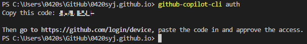

[GitHub Next](https://githubnext.com/)에서 공개한 Copilot for CLI를 체험해보았습니다.

:::info

글의 일부는 Copilot에 의해 작성되었습니다.

:::

## 써보기 전에 🚶

### GitHub Copilot이란?

[Copilot for CLI](https://githubnext.com/projects/copilot-cli/)는 GitHub에서 만든 오픈소스 프로젝트로, GitHub Copilot을 CLI에서 사용할 수 있게 해줍니다. 앞의 링크에서 **Sign up for the waitlist**를 클릭하면, GitHub Copilot을 사용할 수 있는 기회를 얻을 수 있습니다.

### 얼마나 기다려야 하나요?

언제 신청했는지 정확히 기억이 나진 않지만, 1달이 채 지나지 않아 아래 이메일이 도착했습니다!


## Copilot for CLI 설치하기 🛠

### 설치

npm을 사용하여 전역 설치를 진행합니다.

```bash
npm install -g @githubnext/github-copilot-cli
```

### 인증

Copilot for CLI를 사용하기 위해서는 GitHub Copilot에 인증이 필요합니다. 인증을 위해서는 GitHub Copilot에 로그인한 후, 아래 명령어를 실행합니다.

```bash
github-copilot-cli auth
```

아래 이미지와 같이 지시사항을 따라서 로그인하면, 인증이 완료됩니다.



## Copilot for CLI 사용해보기 🤖

우선 `github-copilot-cli -h`로 명령어를 확인해봅니다.

```
Usage: Copilot CLI [options] [command]

A CLI experience for letting GitHub Copilot help you on the command line.

Options:
  -V, --version                        output the version number
  -h, --help                           display help for command

Commands:
  auth                                 Retrieve and store a GitHub Access Token.
  alias <shell path>                   Add convenient GitHub Copilot CLI aliases to your shell.
  what-the-shell [options] <query...>  Use GitHub Copilot to get shell commands from natural
                                       language descriptions.
  git-assist [options] <query...>      Translate a natural language description of a git command to
                                       an actual git command.
  gh-assist [options] <query...>       Convert plain english to GitHub CLI commands.
  help [command]                       display help for command
```

### alias 추가하기

`alias` 명령어를 사용하면, Copilot for CLI를 사용하기 편리하게 alias를 추가할 수 있습니다.

```bash
eval "$(github-copilot-cli alias -- "$0")"
```

### 1. `what-the-shell` (`??`)

:::note

실행환경 : WSL Ubuntu 22.04

:::

`what-the-shell` 명령어를 사용하면, GitHub Copilot을 통해 자연어로 Shell 명령어를 작성할 수 있습니다.

recursive하게 원하는 디렉토리(docs, blog, src)만 tree로 출력하는 명령어를 작성해보겠습니다.

```bash
github-copilot-cli what-the-shell "directory tree"
```

위의 [alias 추가하기](#alias-추가하기)에서 추가한 alias를 사용하면, 아래와 같이 사용할 수 있습니다.

```bash
?? "directory tree"
```


```bash
tree -R docs blog src
```

원하던 명령어가 나왔습니다! 🎉

### 2. `git-assist` (`?git`)

## 마치며 🎉

아직 추가하지 못한 기능이 많지만, 앞으로 계속 구현해나가며 Tutorial에 추가할 예정입니다.
