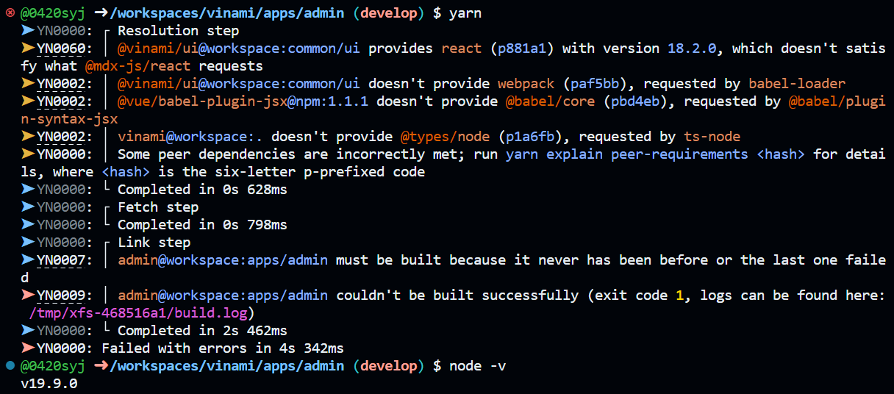

Github Codespaces로 작업 중, nuxt build 과정에서 `The "name" argument must be specified` 오류가 발생했습니다.

<!-- truncate -->

### 오류 당시 환경

- Node 버전 : v19.9.0
- Nuxt 버전 : v3.3.1



로그를 확인해보니 nuxt에 문제가 있어보입니다.

```log
# This file contains the result of Yarn building a package (admin@workspace:apps/admin)
# Script name: postinstall

Nuxi 3.3.1

 ERROR  The "name" argument must be specified

  at new NodeError (node:internal/errors:399:5)
  at Performance.mark (node:internal/perf/performance:125:13)
  at normalizedModule (/workspaces/vinami/node_modules/@nuxt/kit/dist/index.mjs:168:30)
  at async installModule (/workspaces/vinami/node_modules/@nuxt/kit/dist/index.mjs:451:15)
  at async initNuxt (/workspaces/vinami/node_modules/nuxt/dist/index.mjs:2469:7)
  at async loadNuxt (/workspaces/vinami/node_modules/nuxt/dist/index.mjs:2523:5)
  at async loadNuxt (/workspaces/vinami/node_modules/@nuxt/kit/dist/index.mjs:539:19)
  at async Object.invoke (/workspaces/vinami/node_modules/nuxi/dist/chunks/prepare.mjs:37:18)
  at async _main (/workspaces/vinami/node_modules/nuxi/dist/cli.mjs:49:20)
```

구글에 `ERROR  The "name" argument must be specified`로 검색해보니 다행히 nuxt github에 이미 누군가 [이슈](https://github.com/nuxt/nuxt/issues/19682)를 등록해뒀습니다.

### 해결방법

예상대로 nuxt와 Node v19 간에 문제가 있으니, Node를 **다운그레이드**하라고 합니다. 이슈가 등록된 시점으로 부터 1달 넘게 지났으니, 차라리 nuxt를 **업그레이드**하겠습니다.

게시글 작성시점 기준 공식 홈페이지에 [3.4 버전](https://nuxt.com/blog/v3-4)이 나왔다는 소식이 있네요.

1. nuxt CLI를 지원하는 `nuxi` 설치

```bash
yarn add -D nuxi
```

2. nuxt 업그레이드

```bash
yarn nuxi upgrade --force
```

Nuxt v3.4.0을 사용하니, Node v19.9.0에서도 잘 동작합니다 🎉
