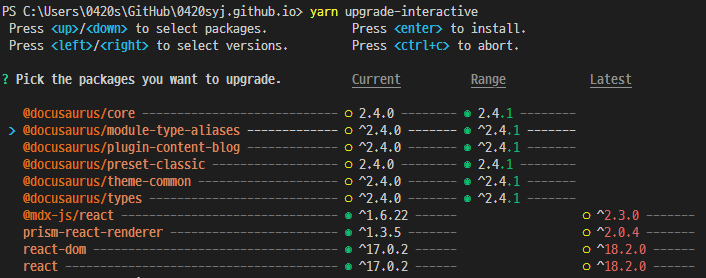

yarn에서 버전에 따라 달라지는 패키지 업그레이드 방법을 알아봅니다.

<!-- truncate -->

## Yarn 1 (Classic)

### `yarn upgrade`

`yarn upgrade` 명령어를 사용하여 아래와 같이 패키지를 업그레이드할 수 있습니다.

```bash
yarn upgrade [package-name]@[version] # 특정 버전으로 업그레이드
yarn upgrade [package-name] # 최신 버전으로 업그레이드
```

자세한 내용은 내용은 [yarn 공식 문서](https://classic.yarnpkg.com/en/docs/cli/upgrade/)를 참고하세요.

### `yarn upgrade-interactive`

`yarn upgrade-interactive` 명령어를 사용하여 아래와 같이 패키지를 업그레이드할 수 있습니다.

```bash
[1/? Choose which packages to update. (Press <space> to select, <a> to toggle all, <i> to inverse s
election)
 devDependencies
❯◯ autoprefixer      6.7.7  ❯  7.0.0          https://github.com/postcss/autoprefixer#readme
 ◯ webpack           2.4.1  ❯  2.5.1          https://github.com/webpack/webpack

 dependencies
 ◯ bull              2.2.6  ❯  3.0.0-alpha.3  https://github.com/OptimalBits/bull#readme
 ◯ fs-extra          3.0.0  ❯  3.0.1          https://github.com/jprichardson/node-fs-extra
 ◯ socket.io         1.7.3  ❯  1.7.4          https://github.com/socketio/socket.io#readme
 ◯ socket.io-client  1.7.3  ❯  1.7.4          https://github.com/Automattic/socket.io-client#readme
```

말 그대로 인터렉티브하게 패키지를 업그레이드할 수 있습니다.

자세한 내용은 [yarn 공식 문서](https://classic.yarnpkg.com/en/docs/cli/upgrade-interactive/)를 참고하세요.

## Yarn 2+ (Berry)

이 글을 작성하게 된 계기는 Yarn 2+ 에서는 `yarn upgrade`가 사라졌기 때문입니다.
대신 `yarn upgrade-interactive`를 사용할 수 있습니다.

하지만 바로 사용할 수 없습니다. 아래에서 자세히 알아보겠습니다.

### `yarn upgrade-interactive`

Yarn 2+ 에서 `yarn upgrade-interactive` 명령어를 사용하기 위해서는, 우선 [`interactive-tools` 플러그인](https://github.com/yarnpkg/berry/blob/HEAD/packages/plugin-interactive-tools/README.md)을 설치해야 합니다.

```bash
yarn plugin import interactive-tools # interactive-tools 플러그인 설치
yarn upgrade-interactive # 패키지 업그레이드
```

아래는 실제 사용해본 모습입니다.



자세한 내용은 [yarn 공식 문서](https://yarnpkg.com/cli/upgrade-interactive)를 참고하세요.
