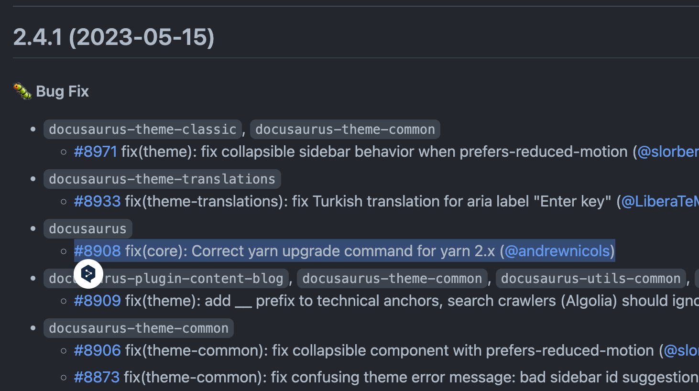
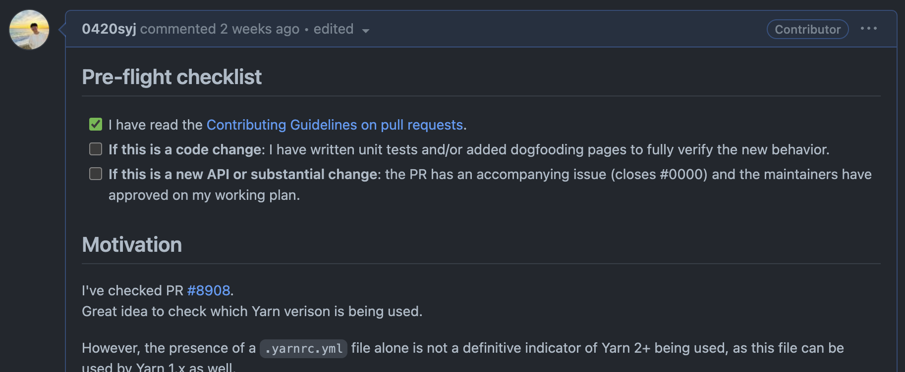
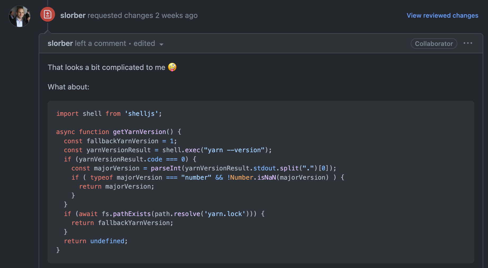
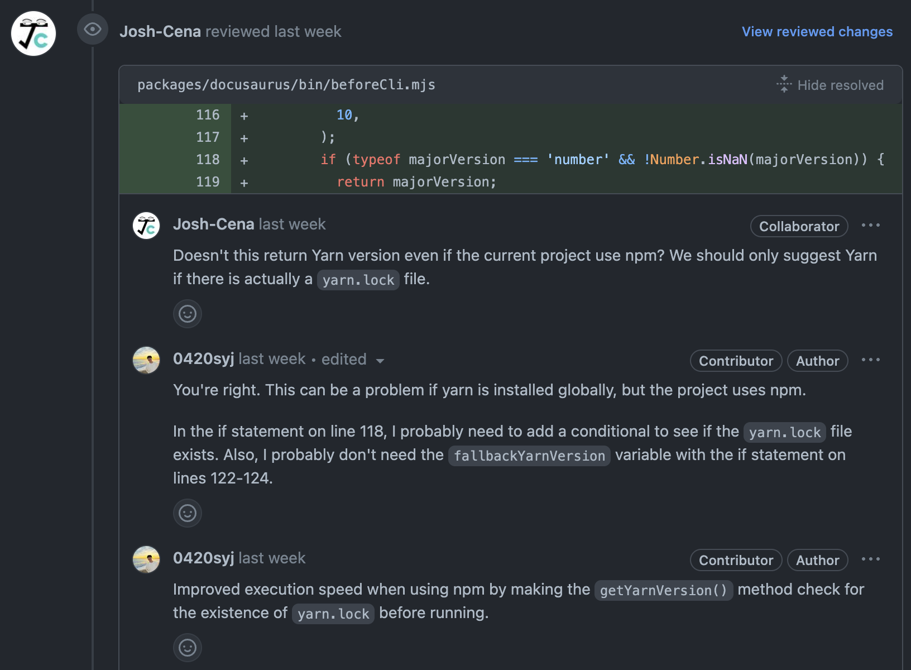
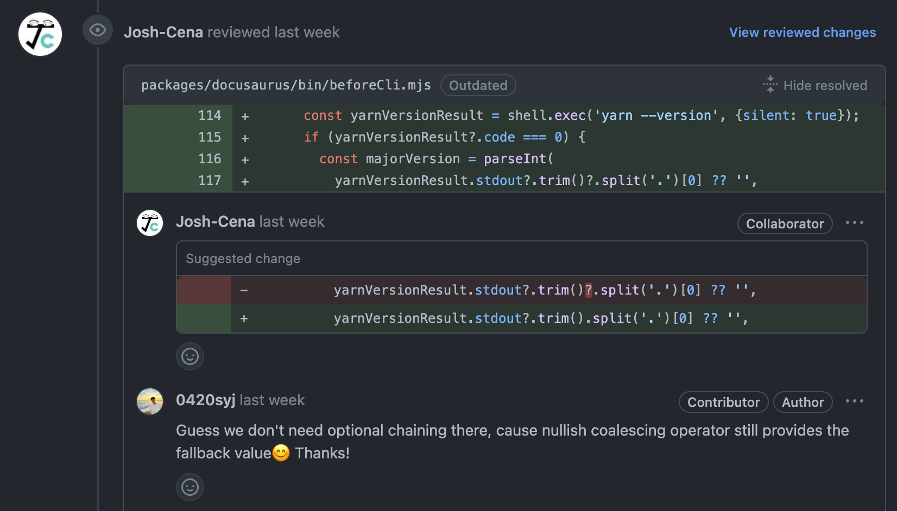
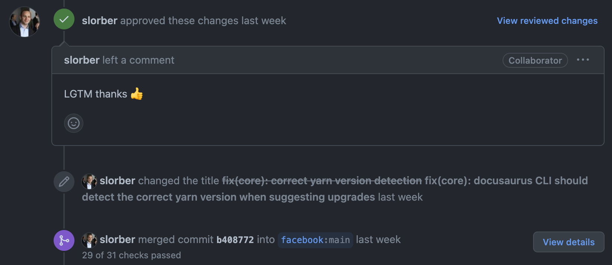

Facebook에서 만든 오픈소스 CMS, [Docusaurus](https://github.com/facebook/docusaurus)에 기여한 후기를 남깁니다.

<!-- truncate -->

## 배경 📖

> 평소에 Docusaurus에 관심이 많았습니다.

지금 보고계신 웹사이트도 Docusaurus로 만들었습니다! 

facebook에서 만들어서인지 커뮤니티도 잘 구축되어있고, 업데이트도 빠른 편입니다.

**그러던 중 작은 오류를 발견했습니다!**

새로운 version이 release되면 빌드 시점에 업그레이드 명령어를 알려주는데, yarn일 경우 오류가 존재했습니다. 저는 yarn berry를 쓰고 있어서, `yarn up`이 출력되어야 하는데 `yarn upgrade`가 출력되고 있었습니다.

앞서 [Yarn에서 패키지 업그레이드하기 🧶](https://0420syj.github.io/blog/yarn-upgrade)를 작성했던 이유가 사실 이 때문이었습니다.

언젠가 큰 오픈소스에 contribution 하고 싶은 욕심이 있었는데, 이때다 싶어 오류를 수정하고 [PR#9006](https://github.com/facebook/docusaurus/pull/9006)을 작성했고 다행히 merge 되었습니다.

## 과정 📝

첫 contribution은 아니지만, 이정도로 큰 오픈소스 프로젝트는 처음이었습니다.

오랜만에 재밌는 경험이기도 했고, 처음으로 오픈소스에 contribution 하고 싶은 분들에게 도움이 될 것 같아 기록을 남깁니다 ☺️

### 1. 최신 코드 확인 👀

> 우선 main 브랜치의 최신 코드를 보고 문제를 파악했습니다.  
> 그런데, 누군가에 의해 이미 버그가 수정되어 있었습니다.

새로 release된 version에서 이미 버그 수정 PR이 있었습니다. 혹시 모르니 해당 파일의 history를 찾아보고, 어떻게 수정되었는지 살펴보기로 했습니다.

### 2. 문제 파악 🕵️‍♂️

당시 기준으로 1달 전에 다른 contributor에 의해 버그가 수정되었습다. 코드를 보니 그 아이디어가 아주 좋았습니다. 하지만, 다시 천천히 생각해보니 여전히 오류가 발생하는 경우가 존재했습니다.

저같은 주니어 개발자도 발견한 버그였으니, 이제부터는 누가 먼저 정확하고 빠르게 PR을 작성하느냐 문제입니다.

개발을 시작하기에 앞서, Issues와 Pull Requests 탭을 살펴봤고 아직 아무도 이 문제를 발견한 사람이 없다는걸 확인했습니다.

어떻게 코드를 수정해야할지 이미 알고 있었기 때문에, 굳이 Issues는 올리지 않고 바로 작업에 들어갔습니다.

### 3. `CONTRIBUTING.md` 읽어보기 📖

규모있는 오픈소스 프로젝트에는 `CONTRIBUTING.md` 파일이 **무조건** 존재합니다. 이 문서에는 PR을 위한 convention이 아주 상세하게 기록되어 있습니다.

여러분이 기여하고 싶은 오픈소스에 이 문서가 없다면, 아래와 같은 상황임을 의심해볼 수 있습니다.

- 기여 가이드 문서가 필요하지 않은 정도의 간단한 오픈소스 프로젝트
- 업데이트가 활발하게 이루어지지 않고 있음

1번째 문제는 주관적이기도 하고, project maintainers 를 잘 배려할 수 있는 자세가 되어있다면 문제가 되지 않습니다. 하지만 2번째 상황인 경우 여러분의 PR은 그 어느 누구에게도 review 받지 못할 수 있습니다.

따라서 기여를 하고 싶다면 해당 오픈소스가 활성화되어있는지, 마지막 release나 commit 날짜를 확인해보는 것이 좋겠습니다.

또한 `CONTRIBUTING.MD`의 간단한 규칙조차 지키지 않은 성의없는 PR을 날린다면, reject 당하는 것은 물론 maintainers에게 큰 불편을 끼칠 수도 있다. 본인의 시간을 할애해서 여러분의 코드를 검토해줄 maintainers이자 reviewers를 최대한 배려합시다!

본론으로 돌아와, [`CONTRIBUTING.md`](https://github.com/facebook/docusaurus/blob/main/CONTRIBUTING.md#pull-requests) 파일을 읽어보고 그에 맞게 PR을 준비했습니다.

### 4. 코드 수정 🛠

해당 프로젝트를 fork한 후, 버그 수정을 위한 branch를 생성합니다. 그리고 수정한 코드를 커밋합니다.
커밋 메시지도 정해진 규칙에 맞게 작성합니다.

첫 PR은 가급적 1개의 commit으로 작성합니다. 그 이유에 대해서는 다음 문단에서 서술하겠습니다.

### 5. PR 날리기 📮

> 이제 PR을 날릴 차례입니다. 이미 정해진 양식이 있었기 때문에, 그에 따라 상세하게 작성합니다.

이미 Merge된 PR들도 함께 살펴보고 보강해서 작성하면 merge될 확률을 높일 수 있습니다.

어떤 문제를, 왜, 어떻게 수정했는지, 그리고 어떻게 테스트했는지 등을 자세히 적었습니다.
이전에 같은 문제에 대한 PR이 있었기 때문에, 테스트 방법은 해당 PR을 참고하여 동일하게 작성했습니다.

### 6. PR 최초 작성 후, 추가 commit ✍️

처음 PR을 날린 후에도 추가 commit을 통해 수정이 가능합니다.

다만 최초 PR의 commit이 여러개인 경우, maintainers가 혼란스러워할 수 있으니 squash해서 하나의 commit으로 만들었습니다.

과거 다른 프로젝트에서는, 1개 PR 당 1개 commit만 있어야 한다는 규칙이 있었습니다.
이 프로젝트에서는 이와 같은 규칙은 없었지만, 리뷰어 관점에서 더 편할 것이라고 생각해 squash했습니다.

사실 첫 PR을 날린 후에 제 코드에서 수정할 사항이 있었는데 squash를 생각하지 못해서, Close하고 새로운 PR을 날렸습니다. 😅

### 7. 첫 리뷰 🤝

> 첫 리뷰는 작성으로부터 일주일이 걸렸습니다.

Reviewer는 제가 제보한 버그와 아이디어에 대해서는 동의했습니다.
다만 제 코드가 다소 복잡하고, 이를 개선할 수 있는 방안을 제시했습니다.

저는 `js-yaml`이라는 라이브러리를 사용하여 간접적으로 yarn version을 확인했는데,
reviewer는 `shelljs`를 사용하여 command line을 통해 보다 직접적으로 yarn version을 확인하는 방법을 제시했습니다.

### 8. 리뷰 확인 후, 코드 수정 🤝

리뷰 내용에 대한 답글을 남겼습니다.
당연히 reviewer의 코드가 훨씬 간결하고, 명령어로 yarn 버전을 확인한다는 점에서 더 좋다고 생각했습니다.

이제 코드를 수정해야 합니다.

처음 PR을 날린 후로 일주일이나 시간이 흘렀기 때문에
작업중인 브랜치와 main branch의 sync를 맞추는 작업이 필요했습니다.
다행히 충돌은 없었습니다.

리뷰를 바탕으로 코드를 수정했고, 이번에는 1개의 commit으로 squash하지 않았습니다.
history를 남기기 위해서 입니다.

### 9. 2번째 리뷰 & 코드 수정 🤝

> 2번째 리뷰는 하루도 채 걸리지 않았습니다.
> 이번에는 다른 reviewer가 리뷰를 해주었습니다.

그 reviewer는 새로운 코드를 보고, 이 코드가 문제가 될 수 있다고 지적했습니다.

그 문제는, `shelljs`를 사용하여 yarn version을 확인하는 코드가 프로젝트의 package manager가 yarn이 아닌 경우에도 실행된다는 것입니다.

답글로 그의 리뷰에 동의하며, 정확히 어떤 상황에서 문제가 발생할 수 있는지 설명했습니다.
더불어 이를 해결하기 위해 어떻게 코드를 수정해야 하는지도 설명했습니다.

곧바로 설명한대로 코드를 수정하여, 새로 commit 했습니다.

추가적으로 리뷰에는 언급되지 않았던 부분도 일부 수정했습니다.
이 부분은 따로 댓글을 남겨, 왜 수정했는지에 대해서도 설명했습니다.

### 10. 마지막 리뷰 👍

> 이전 reviewer가 다시 리뷰를 해주었습니다.
> 불필요한 연산자를 제거하는 것을 제안했습니다.

왜 그것이 불필요한지 생각해보고, 어떤 면에서 reviewer의 코드가 더 나은지에 대해 생각해봤습니다.
결론적으로 reviewer의 코드가 더 나았습니다.

코드 수정 제안을 수락하자, 바로 commit이 이루어졌습니다.

### 11. PR Merge 🎉

> 처음 리뷰해주었던 reviewer가 오픈소스 세계에서는 마지막 리뷰라고 할 수 있는 그 댓글, "LGTM"을 남겼습니다.

이윽고 저의 PR이 Merge되었다.
이로써 Docusaurus main branch에 반영되었습니다.

### 12. 마무리 🎬

제가 작업했던 branch, fork했던 repository는 삭제했습니다.

직업했던 내용은 아마 v2.4.2 버전에 반영될 것입니다.

이제 Docuaurus에서 yarn berry를 사용하는 유저는
올바른 버전 업그레이드 명령어를 확인할 수 있습니다.

## 후기 📝

이번 PR을 통해, 오픈소스에 기여하는 과정을 경험해보았습니다.
지나고 보니 크게 아래 3가지가 오픈소스 기여에 있어서 중요한 것 같습니다.

### 평소에 오픈소스에 관심 가지기

평소에 사용하고 있는 오픈소스에 관심을 가지고, 사용하면서 문제점을 발견하고, 이를 해결하는 할 수 있는 방법 생각해보면 좋습니다. 저의 경우에는 블로그를 위해 Docusaurus를 사용하다가 문제점을 발견했습니다.

### 이미 Merge된 PR을 찾아보기

각 오픈소스마다 나름의 컨벤션과 문화가 존재합니다. 이를 가장 빠르고 쉽게 파악할 수 있는 방법은 이미 Merge된 PR을 찾아보는 것입니다.

### Review를 긍정적으로 검토하기

우리에게 review를 남겨줄 reviewer이자 해당 프로젝트의 maintainer들은 그 프로젝트를 누구보다 가장 잘 이해하는 사람들입니다. 그분들의 review는 결국 그 프로젝트를 더 발전시키는 것을 목표로 하고 있습니다.

그리고 대형 프로젝트라면 그만큼 뛰어난 분들이기 때문에, 그분들의 review는 더욱 가치가 있습니다. 저는 특히나 주니어 개발자 입장에서 그분들의 review를 뛰어난 시니어 개발자로부터 review를 받을 수 있는 좋은 기회라고 생각하고 받아들였습니다. 실제로 그분들의 review를 통해 많이 배웠습니다.

## 마치며 🖋️

앞으로도 오픈소스에 기여할 수 있는 기회가 생긴다면, 다시 한 번 빠르게 달려들어 PR를 날려봐야겠습니다.
이글을 읽게 될 저와 같은 오픈소스 초보 기여자에게 도움이 되었으면 좋겠습니다 😊