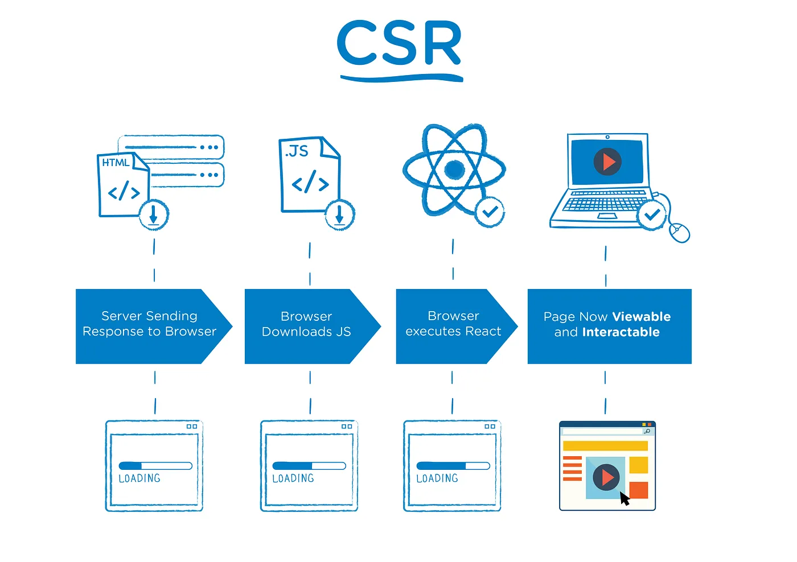
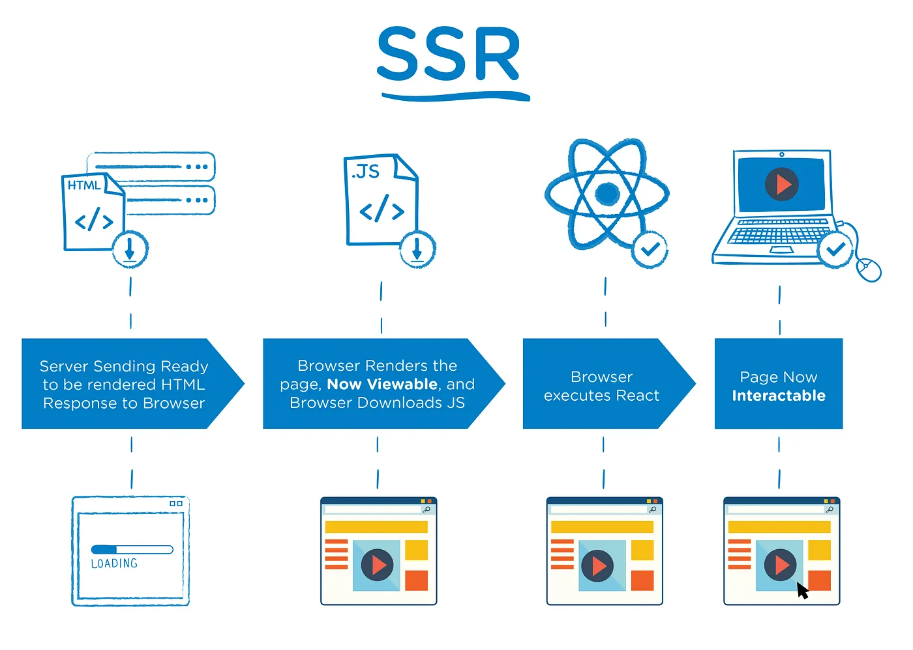

Next.js에 대한 기본 개념을 정리합니다.

<!-- truncate -->

## Next.js 소개 🌐

Next.js는 서버 사이드 렌더링(SSR) 및 정적 사이트 생성(SSG) 기능을 추가하여 React의 기본 기능을 향상시키는 React 기반 프레임워크입니다.

## Next.js 특징 📝

기본적으로 Next.js는 모든 페이지를 미리 렌더링합니다. 즉, 클라이언트 측 JavaScript가 모든 작업을 수행하는 대신 Next.js가 각 페이지에 대한 HTML을 미리 생성합니다. 사전 렌더링은 성능과 SEO를 개선할 수 있습니다.

생성된 각 HTML은 해당 페이지에 필요한 최소한의 자바스크립트 코드와 연결됩니다. 브라우저에서 페이지가 로드되면 해당 JavaScript 코드가 실행되어, 완전히 인터랙티브한 페이지가 됩니다. 이 과정을 **Hydration**이라고 합니다.

:::info

### Hydration

**Hydration**은 서버 측 렌더링된 HTML에 클라이언트 측 자바스크립트를 추가하는 과정을 말합니다. 이 과정을 통해 초기 페이지 로드 시 클라이언트 측 자바스크립트가 실행되어 페이지가 완전히 인터랙티브한 상태가 됩니다.

:::

Next.js는 2가지 유형의 사전 렌더링을 지원합니다.

- **Static Generation** : 빌드 시 미리 HTML을 생성합니다.
- **Server-side Rendering** : 매 요청마다 HTML을 생성합니다.

## 렌더링 방식 이해하기 📄

Next.js를 완전히 이해하려면 CSR, SSR, SSG의 개념을 이해하는 것이 중요합니다.

### CSR

React를 사용한 **CSR**에서 브라우저는 최소한의 HTML 페이지와 페이지에 필요한 자바스크립트를 다운로드합니다. 이후 자바스크립트를 통해 DOM을 업데이트하고 페이지를 렌더링합니다. 애플리케이션을 처음 로드할 때 사용자가 전체 페이지를 보기까지 약간의 지연이 발생할 수 있는데, 이는 모든 자바스크립트가 다운로드, 구문 분석 및 실행될 때까지 페이지가 완전히 렌더링되지 않기 때문입니다.

> 출처 : https://medium.com/walmartglobaltech/the-benefits-of-server-side-rendering-over-client-side-rendering-5d07ff2cefe8

페이지가 처음 로드된 후에는 필요한 데이터만 가져오면 되고 자바스크립트가 전체 페이지를 새로 고칠 필요 없이 페이지의 일부를 다시 렌더링할 수 있으므로, 일반적으로 동일한 웹사이트의 다른 페이지로 이동하는 것이 더 빠릅니다.

Next.js에서는 클라이언트 측 렌더링을 구현할 수 있는 두 가지 방법이 있습니다:

- `useEffect`를 사용하여 클라이언트 측 데이터 가져오기
- `SWR` 또는 `TanStack Query`를 사용하여 클라이언트 측 데이터 가져오기

#### 장점 👍

- 사용자 경험 개선: CSR은 사용자 상호 작용에 따라 실시간으로 페이지를 업데이트하여 원활한 사용자 경험을 제공할 수 있습니다.
- 서버 부하 감소: 모든 렌더링 작업이 클라이언트 측에서 이루어지므로 서버의 부하를 크게 줄일 수 있습니다.

#### 단점 👎

- 초기 로딩 시간 증가: 모든 자바스크립트를 클라이언트 측에서 로드하고 실행해야 하므로 초기 로딩 시간이 길어질 수 있습니다.
- SEO 문제: 검색 엔진이 JavaScript를 완전히 해석하지 못하면 페이지의 콘텐츠를 제대로 색인화하지 못할 수 있습니다.

### SSR

SSR은 웹 페이지의 콘텐츠를 서버 측에서 생성하고 그 결과 HTML을 클라이언트로 전송하는 방식입니다. 이를 통해 초기 페이지 로드 시 콘텐츠를 더 빠르게 전달할 수 있으며 SEO에 유리합니다.

> 출처 : https://medium.com/walmartglobaltech/the-benefits-of-server-side-rendering-over-client-side-rendering-5d07ff2cefe8

페이지에 SSR을 사용하려면 `getServerSideProps`라는 비동기 함수를 내보내야 합니다. 이 함수는 요청이 있을 때마다 서버에서 호출됩니다.

#### 장점 👍

- 초기 로딩 시간 개선 : 서버에서 페이지를 렌더링하므로 초기 로딩 시간이 단축됩니다.
- 실시간 데이터 반영 : 서버에서 페이지를 렌더링하므로 사용자 상호 작용에 따라 페이지를 실시간으로 업데이트할 수 있습니다.

#### 단점 👎

- 서버 부하 증가: 모든 렌더링 작업이 서버에서 수행되므로 서버의 부하가 증가합니다.

:::info

#### SPA에 SSR이 필요한 이유 🤔

SPA(단일 페이지 애플리케이션)는 모든 페이지를 한 번에 로드하고 사용자 상호 작용에 따라 페이지를 동적으로 업데이트합니다. 따라서 다른 페이지로 이동할 때마다 전체 페이지를 다시 로드할 필요가 없어 사용자 경험이 향상됩니다. 그러나 SPA는 CSR 접근 방식을 사용하므로 초기 로딩 시간이 길고 SEO 문제가 발생할 수 있습니다. SSR은 이러한 문제를 해결하는 데 사용됩니다.

:::

### SSG

SSG는 웹 페이지의 콘텐츠가 빌드 시점에 미리 생성되는 방식입니다. 이를 통해 초기 페이지 로드 시 콘텐츠를 더 빠르게 전달할 수 있으며 SEO에 유리합니다. 또는 CDN에 페이지를 캐시하여 사용자에게 더 빠르게 페이지를 제공할 수도 있습니다.

#### 장점 👍

- 초기 로딩 시간 단축: 빌드 시점에 모든 렌더링 작업이 수행되므로 초기 로딩 시간을 크게 단축할 수 있습니다.
- SEO 개선: SSG를 사용하면 검색 엔진이 페이지의 콘텐츠를 적절하게 색인화할 수 있습니다.

#### 단점 👎

- 사용자 경험: 사용자 상호 작용에 따라 페이지를 실시간으로 업데이트할 수 없으므로 대화형 사용자 환경이 저하될 수 있습니다.
- 빌드 시간: 빌드 시 모든 렌더링 작업이 수행되므로 특히 규모가 큰 사이트의 경우 빌드 프로세스가 더 오래 걸릴 수 있습니다.

:::info

### SSR 🆚 SSG

SSR은 사용자 요청에 따라 서버에서 페이지를 생성하여 사용자 상호 작용에 따라 실시간으로 업데이트할 수 있지만 서버 부하가 증가합니다. 반면 SSG는 빌드 시점에 페이지를 생성하므로 초기 로드 시간이 단축되고 SEO가 개선되지만 사용자 상호 작용에 따라 페이지를 실시간으로 업데이트할 수 없습니다.

:::

## `npm run dev`를 실행하면 어떤 일이 일어나나요?

`npm run dev`를 실행하면 Next.js 개발 서버가 시작됩니다. 개발 서버는 코드를 변경할 때마다 자동으로 다시 시작(핫 리로드)됩니다.

### Next.js Repository 살펴보기 🔍

`npm run dev`를 실행하면 Next.js CLI가 실행됩니다. Next.js CLI는 `next-dev`라는 Node.js 스크립트를 실행합니다. 이 스크립트는 `next` 패키지의 `next-dev.ts` 파일에 정의되어 있습니다.

Next.js Repository를 살펴보면 `next-dev.ts` 파일을 찾을 수 있습니다

> 링크 : https://github.com/vercel/next.js/blob/canary/packages/next/src/cli/next-dev.ts

#### 주요기능

- command line arguments를 파싱합니다.
- 프로젝트 디렉터리, 포트, 호스트 이름 등 개발 서버 옵션을 설정합니다.
- turbo 플래그가 설정되어 있는지 확인합니다. 설정되어 있으면 개발 서버에 터보 모드를 설정합니다.
