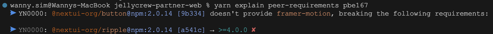
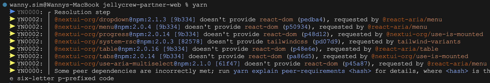
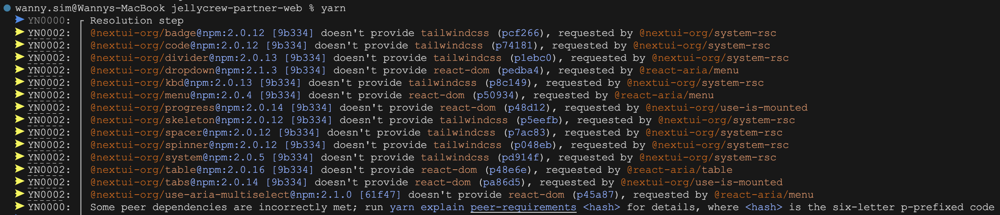
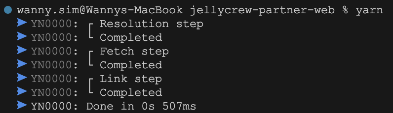

의존성 정보가 잘못된 패키지의 의존성을 수정하는 방법을 알아봅니다.

<!-- truncate -->

## 문제 발견 😭

[NextUI](https://nextui.org/)를 사용하면서 `yarn install`을 실행하면 다음과 같은 Warning이 발생했습니다.


> `@nextui-org/button@npm:2.0.14 [9b334] doesn't provide framer-motion (pbe167), requested by @nextui-org/ripple`
> 단순한 Warning이지만, 앞으로 매 빌드때마다 Warning이 발생하면 굉장히 귀찮을 것 같아서 해결 방법을 찾아보았습니다.

## 문제 파악 🤔

우선 `framer-motion`과 관련된 오류를 살펴보자.



`@nextui-org/button`과 `@nextui-org/card`는 `@nextui-org/ripple`를 dependency로 가지고 있습니다. 그리고 `@nextui-org/ripple`는 `framer-motion`을 peerDependency로 가지고 있습니다.

그러나 `@nextui-org/button`과 `@nextui-org/card`는 `framer-motion`을 peerDependency로 가지고 있지 않습니다.

:::info `peerDependencies`란?

`peerDependencies`란 실제로 패키지에서 `require`나 `import`하지는 않지만, 특정 라이브러리나 툴에 호환성을 필요로 할 경우에 명시하는 dependencies다. npm3 부터 6까지는 `peerDependencies`가 자동으로 설치되지 않았고, 설령 버전이 맞지 않더라도 경고 문구만 뜰 뿐이었다. 그러나 npm@7 부터는 기본으로 설치되고, 이 버전이 맞지 않으면 에러도 발생한다.
출처 : https://yceffort.kr/2021/10/debt-of-package-json

:::

## 해결 방법 🤩

크게 2가지가 있습니다.

1. NexUI Github에 문제를 일으키는 패키지에 peerDependency를 추가해달라고 요청하기
2. Yarn Package Extensions를 사용하여 문제를 일으키는 패키지의 의존성 정보를 수정하기

UI 프레임워크인만큼 패키지 의존성 정보에 대해서는 관리자가 가장 잘 알거라고 생각합니다. 따라서 PR을 바로 올리기보다는 Issue를 남겨서 문제를 해결해달라고 요청하는 편이 좋겠습니다.

그러나 이 글에서는 2번 방법을 사용하여 문제를 해결해보겠습니다.

## Yarn Package Extensions 📦

Yarn Package Extensions는 Yarn 2.0에서 새롭게 추가된 기능입니다. Yarn Berry에서는 `.yarnrc.yml` 파일에 `packageExtensions`를 추가하여 패키지 의존성 정보를 수정할 수 있습니다.

위에 `framer-motion`과 관련된 오류를 해결하기 위해서는 `@nextui-org/button`과 `@nextui-org/card`의 `framer-motion`을 peerDependency로 추가해주면 됩니다.

```yml
# .yarnrc.yml
packageExtensions:
  "@nextui-org/button@*":
    peerDependencies:
      framer-motion: "*"
  "@nextui-org/card@*":
    peerDependencies:
      framer-motion: "*"
```

이제 `yarn install`을 실행하면 다음과 같이 Warning이 발생하지 않습니다.



다음으로 `tailwindcss`와 관련된 오류를 살펴보겠습니다.

`@react-aria/menu`에서 peerDependency로 `tailwindcss`를 가지고 있으나, `@nextui-org/system-rsc`에서는 `tailwindcss`를 peerDependency로 가지고 있지 않습니다. 이 상황에서도 peerDependency로 추가해주면 간단히 해결될까요?



`@nextui-org/system-rsc`를 의존하는 모든 패키지에 `tailwindcss`를 peerDependency로 추가해줘야 하는 문제가 발생합니다. 이런 경우는 다른 방법을 사용해야 합니다.
`peerDependenciesMeta`를 사용하면 특정 패키지의 peerDependency 관련 속성을 수정할 수 있습니다.

```yml
# .yarnrc.yml
packageExtensions:
  "tailwind-variants@*":
    peerDependenciesMeta:
      tailwindcss:
        optional: true
```

위와 같이 설정하면, 더 이상 `tailwind-variants`를 의존하는 패키지에 `tailwindcss`를 peerDependency로 추가할 필요가 없습니다. 다만 제 프로젝트에는 `tailwindcss`가 설치되어있으며 삭제할 일이 없기 때문에 `optional: true`를 추가했습니다.

## 결론 📕

```yml
packageExtensions:
  "tailwind-variants@*":
    peerDependenciesMeta:
      tailwindcss:
        optional: true
  "@nextui-org/button@*":
    peerDependencies:
      framer-motion: "*"
  "@nextui-org/card@*":
    peerDependencies:
      framer-motion: "*"
  "@react-aria/menu@*":
    peerDependenciesMeta:
      react-dom:
        optional: true
  "@react-aria/table@*":
    peerDependenciesMeta:
      react-dom:
        optional: true
  "@nextui-org/progress@*":
    peerDependencies:
      react-dom: "*"
  "@nextui-org/tabs@*":
    peerDependencies:
      react-dom: "*"
  "@nextui-org/react@*":
    peerDependencies:
      react-dom: "*"
```



위와 같이 `.yarnrc.yml` 파일을 수정하니 모든 Warning이 사라졌습니다.

오류를 해결하며 이번 기회에 dependency와 peerDependency에 대해서도 알아보았습니다. 또한 Yarn Package Extensions를 사용하여 패키지 의존성 정보를 수정하는 방법도 알아보았습니다.

다만 앞으로 아래와 같은 점을 주의해야겠습니다.

- Peer Dependency를 추가할 때는 해당 패키지가 의존하는 모든 패키지에 추가해야 하므로, 패키지 배포시에는 신중하게 결정해야 합니다.
- Yarn Package Extensions을 사용하려는 경우, 현재 자신의 프로젝트에 설치된 패키지와 버전에 대해서도 명확하게 알고 있어야 합니다.

## 참고 자료 📚

- https://yarnpkg.com/configuration/yarnrc#packageExtensions
- https://beomy.github.io/tech/etc/yarn-berry/
- https://yceffort.kr/2021/10/debt-of-package-json
- https://github.com/yarnpkg/berry/issues/1255
- https://stackoverflow.com/questions/61908394/when-running-yarn-install-what-does-it-mean-when-a-module-doesnt-provide-anoth
- https://dev.to/arcanis/implicit-transitive-peer-dependencies-ed0
- https://helloinyong.tistory.com/341
