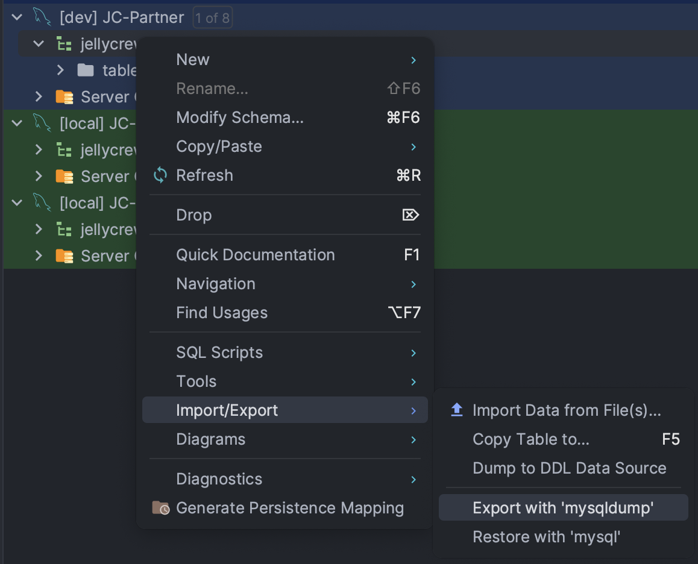
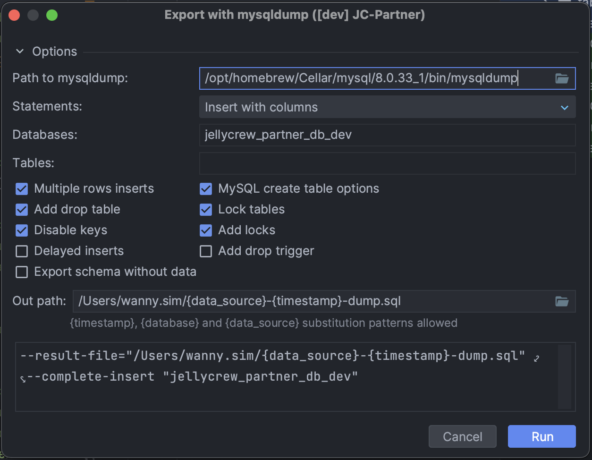
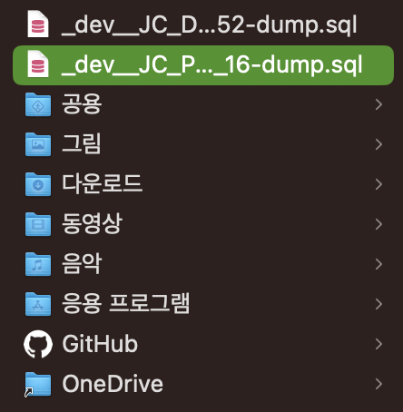
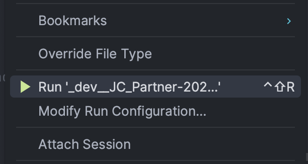
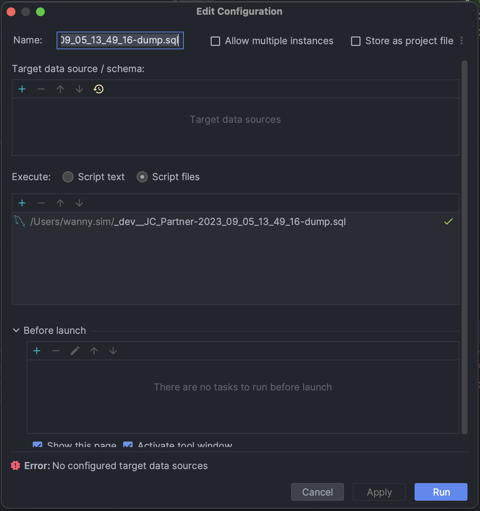
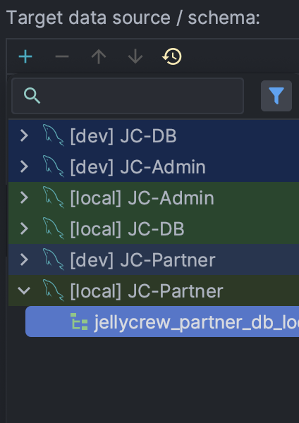
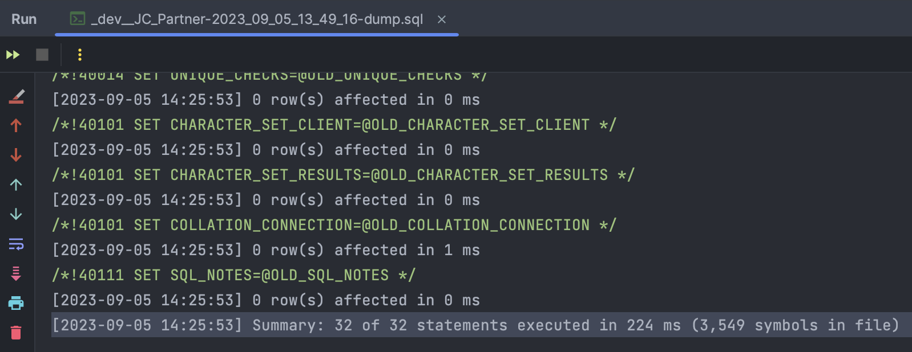

IntelliJ에서 mysqldump를 사용하여 DB Dump 파일을 생성하는 방법을 알아봅니다.

<!-- truncate -->

## 서론 📖

프론트엔드 개발 업무를 맡고 있지만, 가능하다면 서버와 DB를 직접 다루는 것을 선호합니다.
서버는 pull을 통해 쉽게 코드를 받아올 수 있지만, DB는 그렇지 않습니다.

여러 방법이 있겠지만, DB Dump 파일을 생성하여 이를 공유하는 방법이 가장 간단하고 편리하다고 생각합니다.

이번 글에서는 IntelliJ에서 mysqldump를 사용하여 DB Dump 파일을 생성하고, 이를 Local DB에 적용하는 방법을 알아보겠습니다.

## 1. DB Dump 파일 생성하기 📁

IntelliJ의 Database 탭에서, Dump를 생성하고자 하는 DB의 Schema를 마우스 오른쪽 버튼으로 클릭합니다.



그러면 아래와 같은 작은 팝업이 나타납니다.



`Path to mysqldump:` 항목에 mysqldump의 경로를 입력합니다.
일반적으로 MySQL이 설치된 경로의 `bin` 폴더에 위치합니다.

아래 옵션은 상황에 따라 선택합니다.
당연한 얘기지만, Lock Tables 옵션을 선택하면 Dump 파일 생성 중에 다른 세션에서 해당 테이블을 수정할 수 없습니다.

설정이 완료되면 `Run` 버튼을 클릭합니다.



Dump 파일이 생성되었습니다.

## 2. Local DB에 Dump 파일 적용하기 📁

시작하기 전에, Dump 파일을 적용할 Schema를 생성하겠습니다.
Export한 Schema와 동일한 이름으로 생성할 필요는 없습니다.

```sql
CREATE DATABASE new_schema; # 적용할 Schema 'new_schema' 생성
SHOW DATABASES; # 생성된 Schema 확인
```

이제 생성한 Schema에 Dump 파일을 적용합니다.

Shell에서 실행할 수도 있지만, IntelliJ에서 실행하는 것이 더 편리합니다.
앞에서 생성한 Dump 파일을 IntelliJ에서 열고, 우클릭하여 `Run`을 클릭합니다.

단축키(MacOS)는 `Control + Shift + R`입니다.



그러면 아래와 같은 작은 팝업이 나타납니다.



`Target data source / schema:` 항목에 적용할 Schema를 선택합니다.



`Run` 버튼을 클릭하면 Console에 적용 결과가 출력됩니다.



적용이 완료되었습니다.

## 참고 자료 📚

- https://www.jetbrains.com/help/idea/export-data.html#create-a-full-data-dump-for-mysql-and-postgresql
- https://velog.io/@sangwoo-sean/IntelliJ로-sql-DB-Dump-하기
