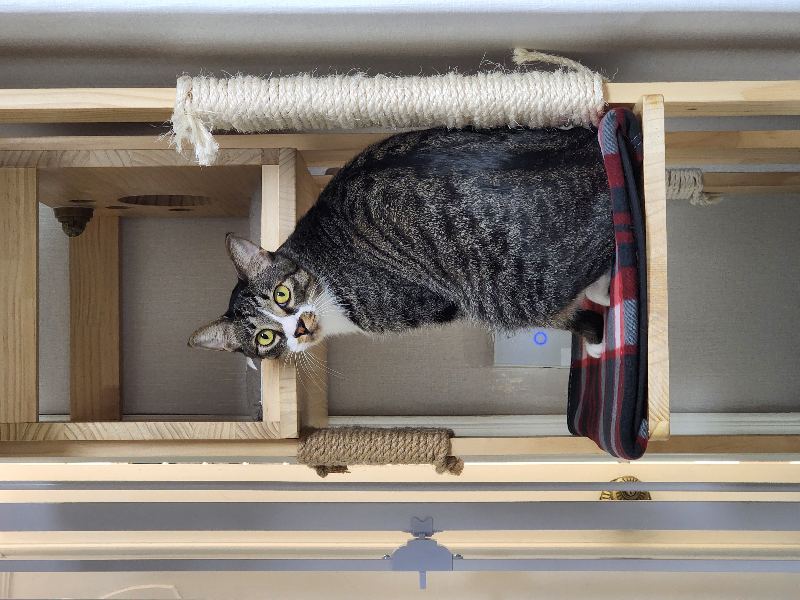
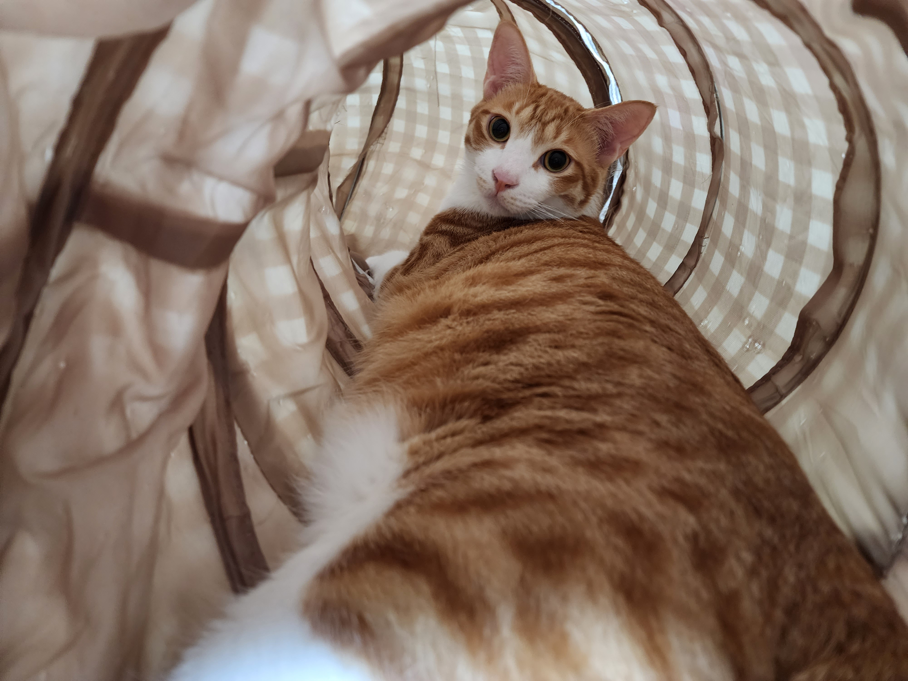

일상적인 내용을 기록하는 공간을 만들었습니다. 오늘의 주제는 고양이입니다.

<!-- truncate -->

## 무슨 내용을 쓰면 좋을까요? 🤔

일기장보다는 조금 public한 느낌으로 쓰고 싶어서, 블로그에 **일상** 카테고리를 만들었습니다.

오늘은 그냥 저의 고양이님 두 분을 소개해드릴까 합니다.

## 머루 🐱

사냥놀이를 굉장히 좋아하는 **머루**입니다.
가장 좋아하는 웹툰인 [환생동물학교](https://series.naver.com/comic/detail.series?productNo=3050030)의 캐릭터 [머루](https://namu.wiki/w/%ED%99%98%EC%83%9D%EB%8F%99%EB%AC%BC%ED%95%99%EA%B5%90/%EB%93%B1%EC%9E%A5%EC%9D%B8%EB%AC%BC#s-1.2.1)에서 따왔습니다.

지금도 놀아달라고 시위중이에요.

## 아키 🐱

애교가 넘치는 **아키**입니다.
마찬가지로 웹툰 [환생동물학교](https://series.naver.com/comic/detail.series?productNo=3050030)의 캐릭터 [아키](https://namu.wiki/w/%ED%99%98%EC%83%9D%EB%8F%99%EB%AC%BC%ED%95%99%EA%B5%90/%EB%93%B1%EC%9E%A5%EC%9D%B8%EB%AC%BC#s-1.2.5)에서 따왔습니다.

컴퓨터 앞에 있으면, 쓰다듬어달라고 머리를 들이대는 편입니다.

## 사이가 참 좋아요 🤗

머루와 아키는 사이가 참 좋아요.
서열은 머루가 더 높습니다 😎
