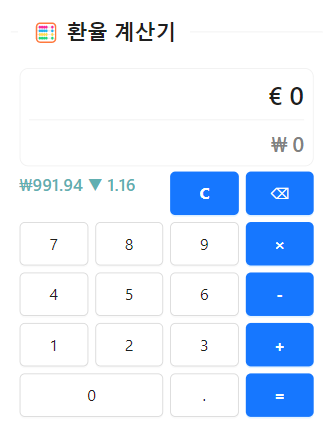

문득 생각난 것들을 정리해보았다.

<!-- truncate -->

## 부정적인 감정에서 벗어나는 방법 🧠

[LinkedIn](https://www.linkedin.com/posts/stevenouri_if-you-are-stuck-with-a-problem-or-cant-activity-7055883225419694080-9WAw?utm_source=share&utm_medium=member_desktop)에서 재밌는 글을 읽었다.

뇌과학 관련 [논문](https://www.sciencedirect.com/science/article/pii/S0306452209001171)을 읽고 정리한 글인데, 대충 *걷기와 같은 중간 강도의 유산소 운동이 사춘기 전 아동의 주의력 조절 능력 향상에 도움이 된다*라는 내용이다.

그것보다 더 재밌는 것은, 글의 마지막에 있는 부분이다.

:::info 부정적인 감정에서 벗어나는 방법

- Tired ➡️ Nap
- Sad ➡️ Music
- Cant focus➡️ Cut screen time
- Angry ➡️ Exercise
- Burnt out ➡️ Read
- Anxious ➡️ Meditate
- Feeling lost ➡️ Pray
- Overwhelmed ➡️ Take a break
- Restless ➡️ Yoga
- Nervous ➡️ Deep breaths
- Unmotivated ➡️ Set small goals

:::

대부분은 공감되는 내용이었다. 일부는 해석 자체가 어려웠다.

어쨋든 부정적인 감정이 들 때, 이 글을 보고 어떤 것을 해야할지 고민해보기로 하자.

## 일본 여행 준비 🗒️

이직 전 휴가기간이 많이 생겨서 일본 여행을 계획하고 있다. 당장 이번 주 목요일이다.

욕심을 많이 냈더니 머리 아프다. 일본에 대한 지식이 부족해서 더 그런 것 같다. 가있는 동안에도 블로깅해야겠다!

## 여행 웹앱에 대한 고민 🤔

지난 12월 재미로 여행에 도움이 되는 웹앱을 만들기 시작했다. 나에게 이직의 계기를 만들어준 어플리케이션이다.

:::note 대표 기능

- 환율 계산기
- 여행 회화문장
- 기상청 링크
- 여행지 LiveCam 링크
- 등등...

:::

유럽때 넣었던 데이터를 일본 오사카&도쿄로 바꿨다.

그런데 정말 대충 만들어서 확장성이 너무 떨어진다. 제법 괜찮은 기능이 많이 있어서 아키텍처를 개선하면 앞으로도 많이 쓸 수 있을 것 같은데 말이다.

기회가 되면 리팩토링을 해보고 public repo로 올려야겠다. (지금은 private이다😅)
