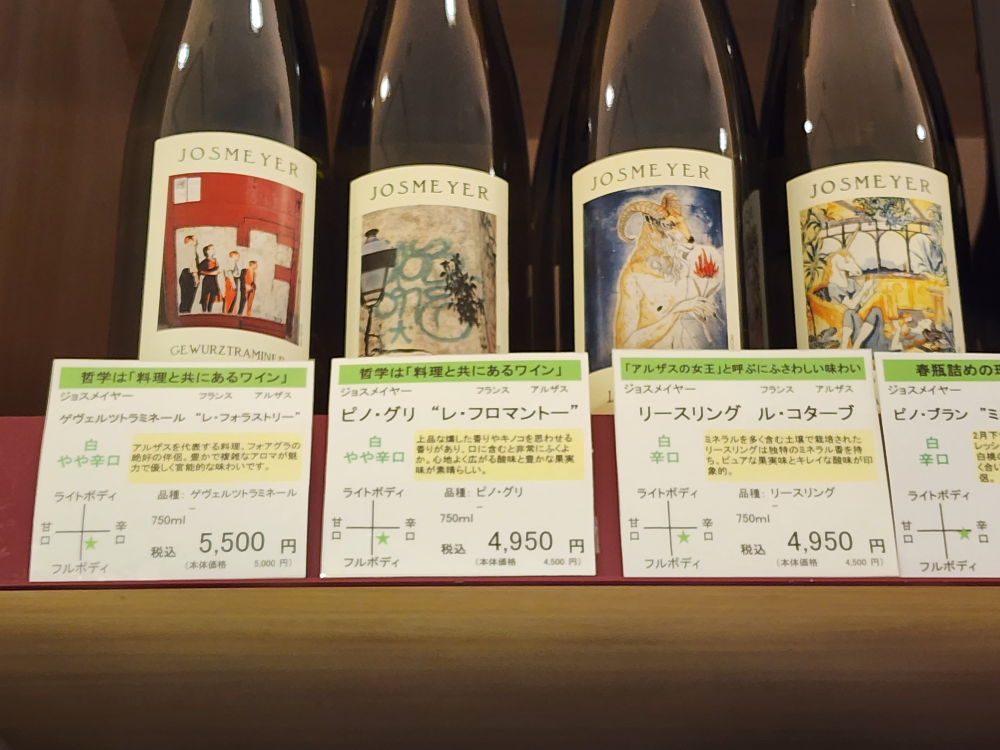
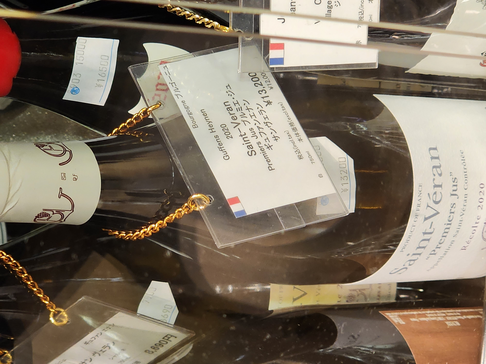
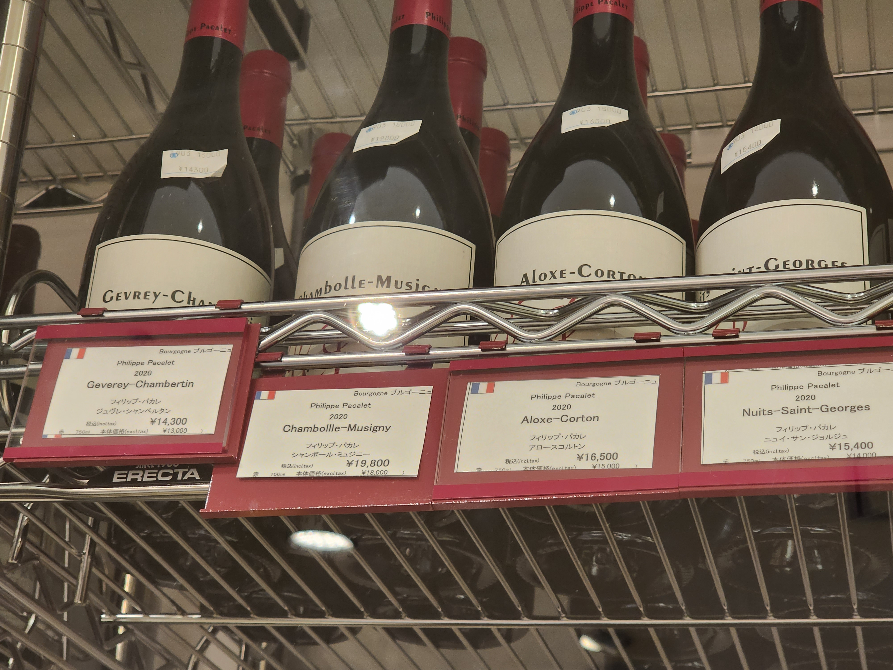
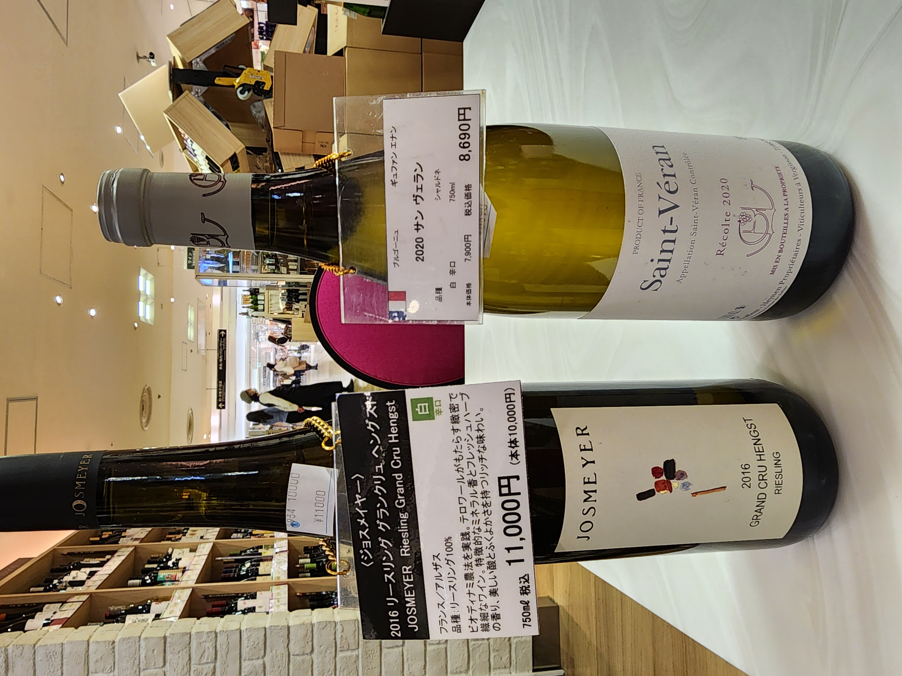
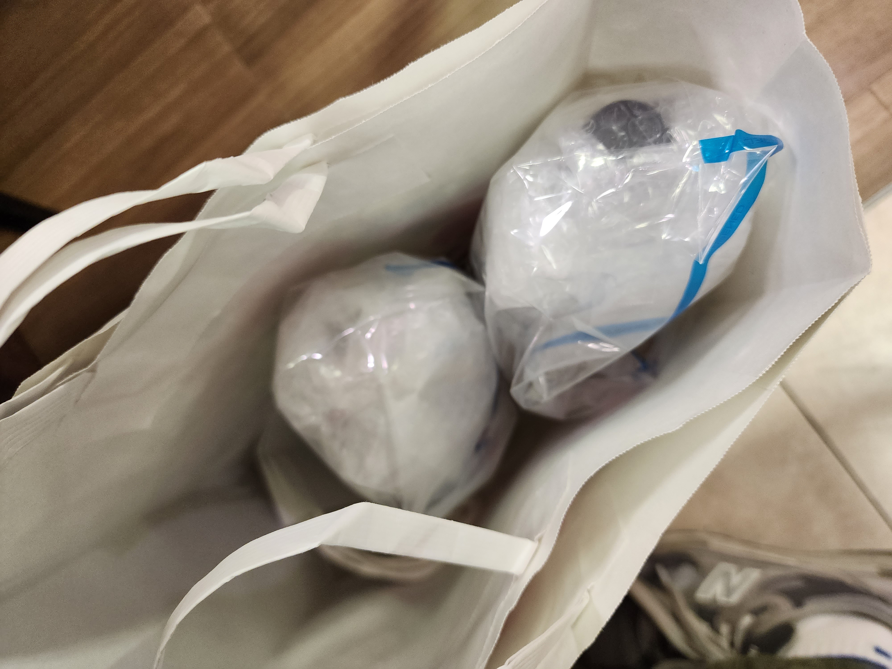

오사카 여행 중 와인을 구입하기 위해 조사했던 내용을 정리해본다.

<!-- truncate -->

## FYI 📌

일본은 아시아에서 와인을 구입하기에는 가장 좋은 나라 중 하나다. 연간 1인당 와인 소비량이 3.5L로 아시아 1위, 세계 19위다. (2020년 기준)

그래서 한국에서는 직구로 밖에 구할 수 없는 와인이나, 터무니없이 비싼 와인을 합리적으로 구입할 수 있다 😊

## 어디서 어떻게 구입할까 🤔

### 온라인 구입

일본은 온라인으로 와인을 구입할 수 있다. 그래서 바쁜 분들은 온라인에서 구입하고, 호텔 측에 미리 연락해 배송받는다고 한다.

:::info 주요 온라인 쇼핑몰

- [라쿠텐](https://www.rakuten.co.jp/category/wine/) : 일본 최대 규모의 온라인 쇼핑몰
- [ELEVIN](https://www.elevin.jp/) : 와인 전문 온라인 쇼핑몰. 라쿠텐에도 입점해있지만, 공식 사이트가 물건이 더 많음. [이용방법](https://cafe.naver.com/winerack24/223163)

:::

### 백화점이 성지

우리나라는 백화점 와인은 보통 비싸다. (물론, [아닌 경우](https://goo.gl/maps/GNrMgDsMRfcExmJo9?coh=178573&entry=tt)도 여럿 있었음)

하지만 일본은 백화점이 와인 성지다. 유명 생산자의 와인들이 한 곳에 모여있고, 관광객 대상 할인행사도 자주있고 면세 혜택받기도 쉽다.

:::info 오사카 주요 백화점

- [다카시마야 백화점](https://goo.gl/maps/pgRSeL7uGQ6df5jX6?coh=178573&entry=tt) B1 와인코너 : 난카이난바역에 위치한 백화점. 오사카 여러 백화점 중 와인 리스트, 가격이 최고였다.
- [긴테쓰 백화점](https://goo.gl/maps/xCBW3FThrg5KWvpv6?coh=178573&entry=tt) B1 와인코너 : 덴노지역에 위치한 백화점. 하루카스 빌딩 안에 있다. 가보진 못했지만, 여긴 고가 와인이 많다고 함.

:::

### 주류 전문점

와인 전문점도 많다. 데일리 와인을 구입하기에는 백화점보다 나을 수 있겠다. 시간이 없어서 직접 가보진 못했다 🥲

:::info 주요 주류 전문점

- [타카무라](https://goo.gl/maps/bGqrZWFv6JoDcJcz8?coh=178573&entry=tt) : 와인, 사케, 위스키와 더불어 커피 전문점과 레스토랑이 함께 있다. 관광지와 지하철역과 멀어서 참 애매하다. 와인 좋아하는 분들 말로는, 굳이 가볼 필요는 없다고 한다.
- [Liquor Mountain](https://goo.gl/maps/M5fAU2x4yYKLs3Jz5?coh=178573&entry=tt) : 체인점이라서 일본 전역에 많다. 오사카에도 여러 곳이 있다. 우메다에서 방문하려다가 시간이 없어서 못갔다.

:::

## 다카시야마 백화점 짧은 후기 📝

오사카 숙소가 다카시야마 인근이라서, 2번 방문했다.
오사카 오는 사람이라면 누구나 지나는 난카이난바역에 위치해 있어서, 오사카 여행 중 시간이 없다면 여기만 가도 충분할 것 같다.

첫날은 무료 시음행사도 하고 있었다! **Josmeyer Le Kottabe Riesling**이였는데 너무 맛있어서 구입했다. 4,700엔 정도. 한국에서는 얼마인지는 모르겠다 😅 (사실 거의 본적이 없다)

후회되는건 이날 그냥 **Guffens-Heynen Saint-Véran '1er Jus'**랑 **Philipe Pacalet**를 구입할걸 그랬다는 것. 그외에도 차라리 부르고뉴 레드를 사면 어땠을까 싶다! 다음에 또 갈 명분이 생겼다 😂

두번째 방문때 **Guffens-Heynen Saint-Véran '1er Jus'**는 팔리고 없었다. 아쉬운대로 **Villages**급으로 만족! 그와 더불어 계속 염두에 두고 있었던 **Josmeyer Riesling Grand Cru Hengst**도 구입했다.

가격표에 굵고 큰 글씨 옆에 작은 글씨로 적힌게 면세 가격이다. 7층에 면세코너가 있어서 바로 환급받을 수 있다. 체크카드로 결제해서 현금으로 환급받았다.

캐리어에 넣고 비행기를 탈 예정이라고 하니, 포장도 엄청 꼼꼼하게 해줬다. 물론, 무료!

여행 후기는 언제쓴담 🤣
