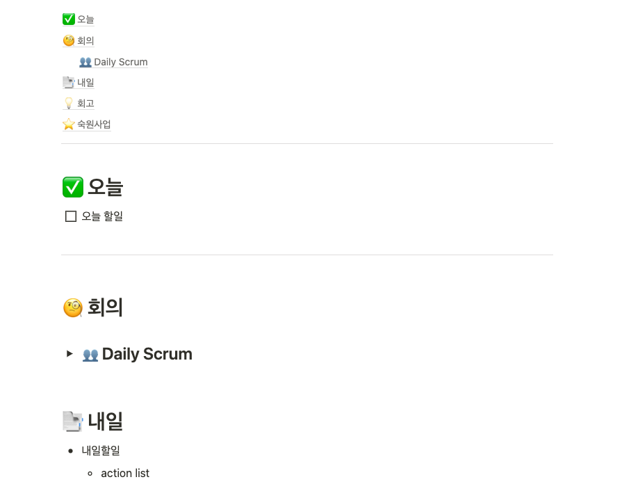

첫 이직을 하고 2주가 지났다. 이직을 하면서 느낀 점들을 정리해본다.

<!-- truncate -->

## 간단하게 적어보는 이직 후기

생각보다 금방 새로운 업무에 적응할 수 있었다. 이전 직장 프로젝트 크기에 비해 작기도 하고, 배웠던 것들이 알게 모르게 도움이 많이 되고있다.

### 업무일지 적기

개인적으로 업무일지를 간단하게 적는게 효율적으로 일하는데 도움이 많이 되고 있다. Notion을 사용해서 적고 있는데 대충 아래와 같은 양식으로 적고있다.

### 맥북은 생각보다 편하다

2년전 인턴때 처음 맥북을 2개월 가량 썼었다. 지금 생각해보면 정규직 전환이 걸린 인턴때 한 번도 안 써본 맥북을 쓰는 정신나간 결정을 한게 이해는 안 된다.

인턴 얘기를 갑자기 하는건, 그만큼 처음 쓰는데도 쉽게 적응할 수 있었다. 그러나 집에서는 윈도우 환경에서 개발을 했기 때문에 금새 맥북은 잊혀졌다. 이 곳에서는 맥북을 사용하고 있고, 생각보다 편하다.

개인적으로 쓰는 그램도 추후에 맥북으로 바꿀 생각이다.

### 통근시간은 30분 밑으로

버스로 30분이 안 걸리던 통근시간이
지하철 1시간으로 늘어났다. 게다가 9호선 급행을 탄다.

통근시간이 길어지니까 금방 피로해진다.

그래서 업무 중 쉬는 시간 루틴을 만들기 위해 노력중이다. 40분(집중) + 5분(휴식)을 생각하고 있지만, 아직 조율이 덜 됐다.

차라리 운동을 다시 시작해야되나 싶기도 하다 😂
