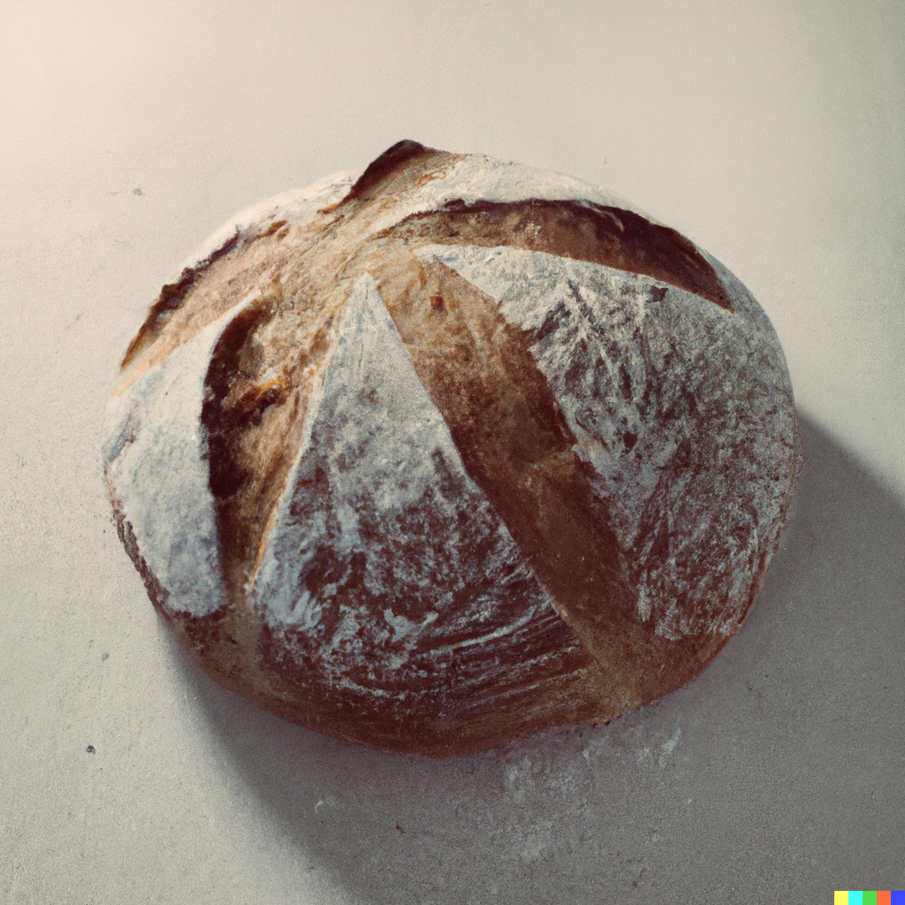
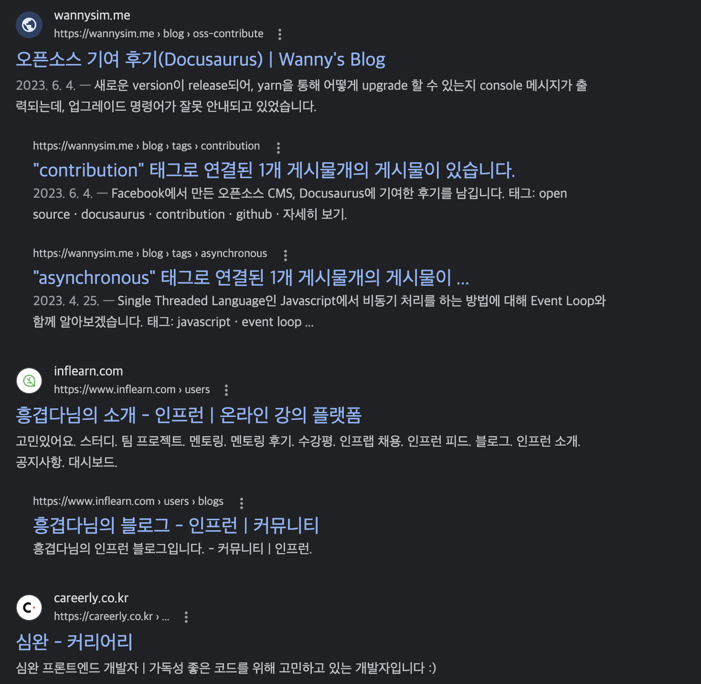

요즘들어 내가 가진 능력에 비해 욕심이 과하지 않나, 생각한다

<!-- truncate -->

## 🖼️ 오늘의 썸네일

> 링크 : https://labs.openai.com/s/g2FopLU0fCiewLdfpJRz5tsw

프롬프트는 `just baked bread in the style of artist Lee Ufan` 였다.

굳이 저런 프롬프트를 던진 이유는 아주 무식하고 단순하다. 이우환 화가의 <조웅>시리즈 중, [Dialogue, 2007](https://www.artsy.net/artwork/lee-ufan-dialogue-400) 이 문득 식빵을 닮았다고 생각했다. 아님말고

아무튼 결과는 잘 모르겠다. <조웅>시리즈 스타일의 단순한 그림을 기대했기 때문

## 💭 요즘 생각

이번 한주동안 했던 이런 저란 생각들

### 공부할 게 너무 많다

- Vue.js, React, Next.js, Typescript, 객체지향, Functional Programming
- Obsidian, CI/CD

이렇게 적어놓고 생각해보니
- 회사 : Vue.js, 객체지향
- 집 : React, Next.js Typescript
이렇게 하고 있다.

회사와 집에서 하는 공부를 일치시킬순 없을까
많이 아쉽다.

그치만 React, Next.js를 잘하고 싶은 욕심 때문에 생기는 일이다.
일단 회사 일이 먼저일까? 미래를 생각해서 개인 공부가 먼저일까?

그냥 다 욕심이다

### Emoji는 문장 맨 앞에

나는 Emoji를 잘 쓰려고 노력하고, 실제로도 제법 잘 쓰고있다!
Header 텍스트와 함께 사용하면, 그 내용을 작은 이미지 하나로 함축해서 전달할 수 있어 더욱 좋다.

그동안은 문장 맨 뒤에 Emoji를 붙여썼는데, 눈이 불편하다고 느꼈다.
여러 문장마다 길이가 다르니 당연한 것이다.

뒤늦게 주변을 보니 대부분 아이콘이 문장 앞부분에 위치한다.

> 어찌보면 당연한건데 왜 이제 알았을까!

### Obsidian 진짜 편하다

블로그 쓸때, 어쩔 수 없이 VSCode 안에서 MD 문서인 블로그를 작성하였는데
Obsidian으로 갈아탔다.

진짜 편하다!

다만 지금은 기능을 5%도 채 활용하지 못하는 기분이다.
여러 기능들(특히 플러그인)을 계속 써봐야겠다.

## 젤다 콘텐츠의 끝은 어디인가

요즘 주말에 시간만 있으면 젤다를 한다.
- 고냉이랑 젤다하는 사진
- 크래프트 기능 참 어렵다는 이야기
