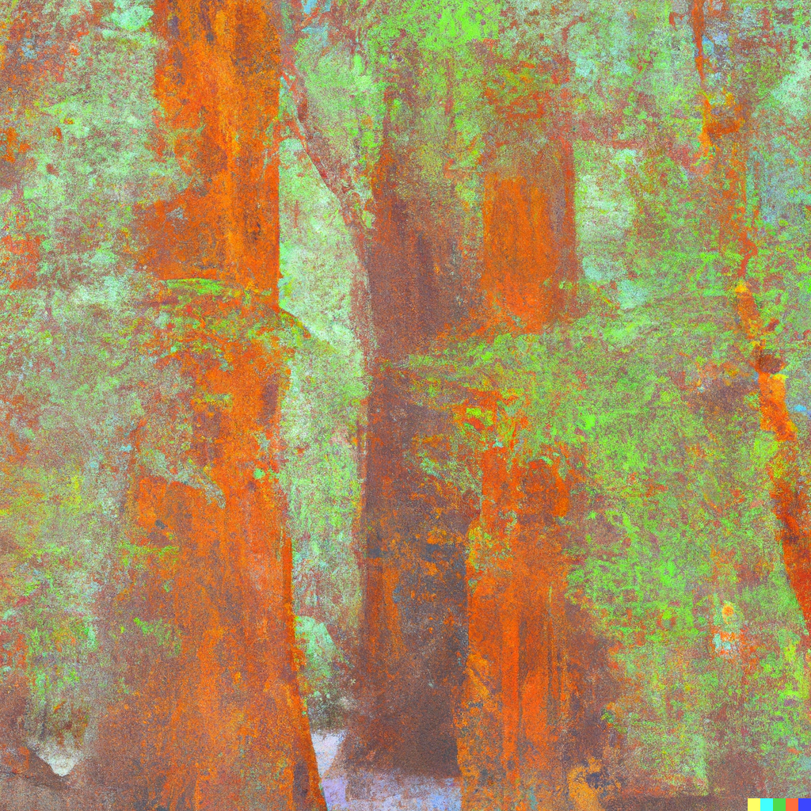

떠다니는 생각을 기록해본다.

<!-- truncate -->

## 썸네일을 만들어봤다

> 링크 : https://labs.openai.com/s/PceeoHDZycVmxFaq5G3f3N4R

DALL-E이라는 AI가 만들어낸 이미지다.
프롬프트는 `A grove of sequoia trees that stretches for miles. Claude Monet-style painting` 였다.

모네가 수련 연작을 그리던 정원 뒷편 어딘가일 것 같다. AI 대단하다.

## 요즘 생각들 정리

### 앞으로 공부할 것들
- JavaScript Fundemental
	- scope
	- event loop
	- 기타 등등
- Svelte 맛보기
- Deno 맛보기
- BFF (Backend For Frontend)의 개념 이해하기

