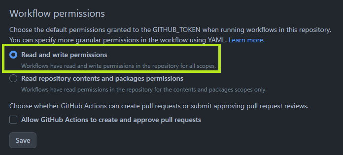

# GitHub Pages에 배포하기

:::info

내용의 일부는 ChatGPT-4를 활용하여 생성되었습니다.

:::

이제 블로그를 만들었으니, GitHub Pages에 배포해봅시다.

## Repository 생성하기

GitHub에 로그인한 후, [New repository](https://github.com/new?repo_name=<username>.github.io) 페이지로 이동합니다.

:::note

`<username>`은 GitHub 계정의 username입니다.  
반드시 수정해주세요.

:::

Repository name에 `<username>.github.io`를 입력하고, Create repository 버튼을 눌러 저장소를 생성합니다.

## Repository 설정하기

생성한 저장소의 **Settings** 탭으로 이동합니다.

**Code and automation > Actions > General > Workflow permissions**에서
**Workflow permissions**을 **Read and write permissions**으로 변경합니다.



Save 버튼을 눌러 설정을 저장합니다.

## 작업내용 커밋하기

프로젝트를 푸시합니다.
`<your-github-username>`은 GitHub 계정의 username입니다.

```bash
git init
git add .
git commit -m "Initial commit"
git branch -M main
git remote add origin https://github.com/<your-github-username>/<your-github-username>.github.io.git
git push -u origin main
```

이제 프로젝트를 main 브랜치에서 확인할 수 있습니다.

## GitHub Actions 설정하기

GitHub Actions를 사용하여 프로젝트를 자동으로 배포하도록 설정합니다.
main 브랜치에 push할 때마다 GitHub Pages에 배포됩니다.

이를 위해 root 디렉토리에 `.github/workflows/` 폴더를 생성하고 `deploy.yml` 파일을 작성합니다.

```yaml
name: Deploy to GitHub Pages

on:
  push:
    branches:
      - main
    # Review gh actions docs if you want to further define triggers, paths, etc
    # https://docs.github.com/en/actions/using-workflows/workflow-syntax-for-github-actions#on

jobs:
  deploy:
    name: Deploy to GitHub Pages
    runs-on: ubuntu-latest
    steps:
      - uses: actions/checkout@v3
      - uses: actions/setup-node@v3
        with:
          node-version: 18
          cache: yarn

      - name: Install dependencies
        run: yarn install --frozen-lockfile
      - name: Build website
        run: yarn build

      # Popular action to deploy to GitHub Pages:
      # Docs: https://github.com/peaceiris/actions-gh-pages#%EF%B8%8F-docusaurus
      - name: Deploy to GitHub Pages
        uses: peaceiris/actions-gh-pages@v3
        with:
          github_token: ${{ secrets.GITHUB_TOKEN }}
          # Build output to publish to the `gh-pages` branch:
          publish_dir: ./build
          # The following lines assign commit authorship to the official
          # GH-Actions bot for deploys to `gh-pages` branch:
          # https://github.com/actions/checkout/issues/13#issuecomment-724415212
          # The GH actions bot is used by default if you didn't specify the two fields.
          # You can swap them out with your own user credentials.
          user_name: github-actions[bot]
          user_email: 41898282+github-actions[bot]@users.noreply.github.com
```

## GitHub Pages에 배포하기

이제 GitHub Actions를 사용하여 GitHub Pages에 배포할 수 있습니다.

```bash
git add .
git commit -m "Add GitHub Actions configuration"
git push
```

이 모든 설정을 마치면, 블로그가 `https://<your-github-username>.github.io`에서 접속 가능해집니다. 새로운 블로그 포스트를 작성하려면 my-blog/blog 폴더에 새로운 Markdown 파일을 추가하고, 변경 사항을 저장소에 푸시하면 됩니다.

이제 Docusaurus를 사용하여 GitHub.io 블로그를 성공적으로 만들었습니다! 새로운 포스트를 작성하고 블로그를 성장시키며 공유하세요!
