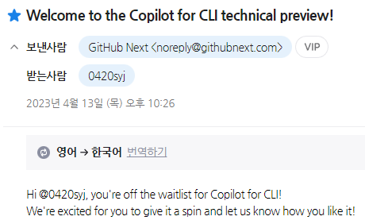
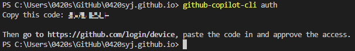
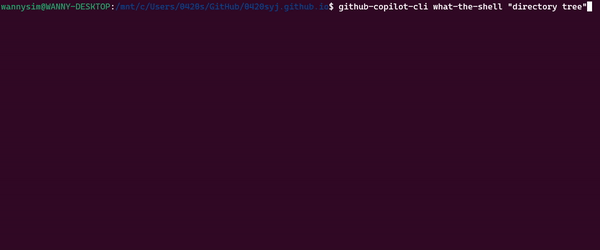
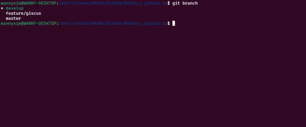
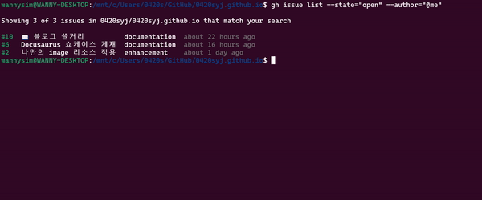
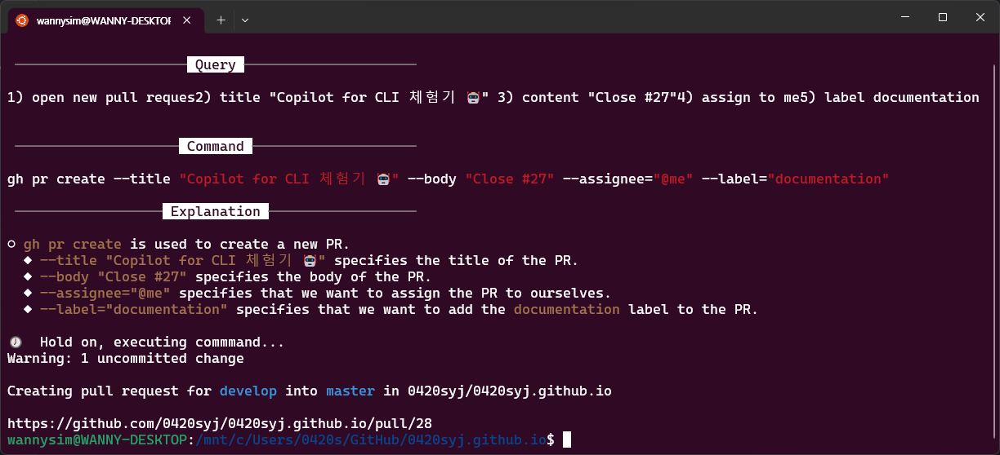
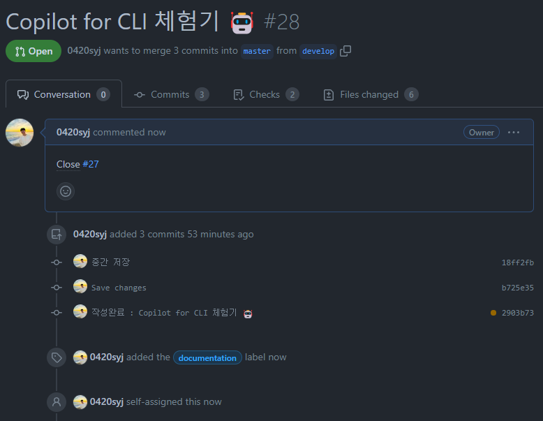

I tried out Copilot for CLI, released by [GitHub Next](https://githubnext.com/).

<!-- truncate -->

:::info

This post is translated by [DeepL](https://www.deepl.com/translator), and corrected by me.

:::

## Before you try it 🚶

### What is GitHub Copilot?

[Copilot for CLI](https://githubnext.com/projects/copilot-cli/) is an open source project created by GitHub that allows you to use GitHub Copilot in CLI. If you click **Sign up for the waitlist** in the previous link, you will be given the opportunity to use GitHub Copilot.

### How long do I have to wait?

I don't remember exactly when I applied, but less than a month later I received the email below!



## Installing the Copilot for CLI 🛠

### Install

Global installation using npm.

```bash
npm install -g @githubnext/github-copilot-cli
```

### Authentication

To use Copilot for CLI, you need to authenticate to GitHub Copilot. To authenticate, log in to GitHub Copilot and execute the command below.

```bash
github-copilot-cli auth
```

Follow the instructions to log in, as shown in the image below, and you'll be authenticated.



## Trying out Copilot for CLI 🤖

:::note

Running Environment : WSL Ubuntu 22.04

:::
First, check your commands with `github-copilot-cli -h`.

```
Usage: Copilot CLI [options] [command]

A CLI experience for letting GitHub Copilot help you on the command line.

Options:
  -V, --version                        output the version number
  -h, --help                           display help for command

Commands:
  auth                                 Retrieve and store a GitHub Access Token.
  alias <shell path>                   Add convenient GitHub Copilot CLI aliases to your shell.
  what-the-shell [options] <query...>  Use GitHub Copilot to get shell commands from natural
                                       language descriptions.
  git-assist [options] <query...>      Translate a natural language description of a git command to
                                       an actual git command.
  gh-assist [options] <query...>       Convert plain english to GitHub CLI commands.
  help [command]                       display help for command
```

### Adding an alias

Using the `alias` command, you can add an alias to make the Copilot for CLI easier to use.

```bash
eval "$(github-copilot-cli alias -- "$0")"
```

### 1. `what-the-shell` (`??`)

With the `what-the-shell` command, you can write shell commands in natural language via GitHub Copilot.

Let's write a command that recursively prints only the desired directories (docs, blog, src) to a tree.

```bash
github-copilot-cli what-the-shell "directory tree"
```

Using the alias you added in [Adding an alias](#adding-an-alias) above, you can use it like this

```bash
?? "directory tree"
```



```bash
tree -R docs blog src
```

That's the command we wanted! 🎉

### 2. `git-assist` (`git?`)

You can write git commands in natural language.

Let's try to delete a branch.

```bash
git-assist "delete branch" # git? "delete branch"
```



I deleted the `feature/giscus` branch that I forgot to delete 😅

### 3. `gh-assist` (`gh?`)

:::info

If you haven't used the GitHub CLI before, please install the [GitHub CLI](https://cli.github.com/) first. For OSes other than Windows, you can follow the [official guide](https://github.com/cli/cli#installation).

:::

It combines the power of the GitHub CLI command and query interface with the ability to generate complex flags and jq expressions for you.

Let's create a new issue.

```bash
gh-assist "open new issue" # gh? open new issue
```



You've created a new issue!

Now let's create a new PR.

```bash
gh-assist "open new pull request" # gh? open new pull request
```

In addition, we'll add the following four instructions

- title "Copilot for CLI 체험기 🤖"
- content "Close #27"
- assign to me
- label documentation




The github cli can now automatically generate PRs that you've been writing by hand!

## Conclusion 🎉

First of all, I was surprised that my comprehension was better than I expected.

I've been used to the GUI environment, so there was something uncomfortable when using the CLI, but I think I can get used to using the CLI while using Copilot for CLI.

In particular, `gh-assist` seems to be helpful for using the GitHub CLI as well.
