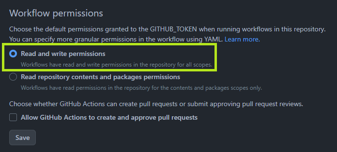

# Deploy to GitHub Pages

:::info

content was generated utilizing ChatGPT-4.

:::

Now that we've created our blog, let's deploy it to GitHub Pages.

## Create a repository

After logging in to GitHub, navigate to the [New repository](https://github.com/new?repo_name=<username>.github.io) page.

:::note

`<username>` is the username of your GitHub account.  
Please be sure to correct it.

:::

Enter `<username>.github.io` for the repository name, and press the Create repository button to create the repository.

## Setting up the repository

Go to the **Settings** tab of the created repository.

Go to **Code and automation > Actions > General > Workflow permissions**.
Change **Workflow permissions** to **Read and write permissions**.



Press the Save button to save the settings.

## Committing your work

Push your project.
`<your-github-username>` is the username of your GitHub account.

```bash
git init
git add .
git commit -m "Initial commit"
git branch -M main
git remote add origin https://github.com/<your-github-username>/<your-github-username>.github.io.git
git push -u origin main
```

You can now see your project in the main branch.

## Setting up GitHub Actions

Set up your project to deploy automatically using GitHub Actions.
Every time you push to the main branch, it will be deployed to GitHub Pages.

To do this, create a `.github/workflows/` folder in your root directory and write a `deploy.yml` file.

```yaml
name: Deploy to GitHub Pages

on:
  Push:
    branches:
      - main
    # Review gh actions docs if you want to further define triggers, paths, etc
    # https://docs.github.com/en/actions/using-workflows/workflow-syntax-for-github-actions#on

jobs:
  deploy:
    name: Deploy to GitHub Pages
    runs-on: ubuntu-latest
    steps:
      - uses: actions/checkout@v3
      - uses: actions/setup-node@v3
        with:
          node-version: 18
          cache: yarn

      - name: Install dependencies
        run: yarn install --frozen-lockfile
      - name: Build website
        run: yarn build

      # Popular action to deploy to GitHub Pages:
      # Docs: https://github.com/peaceiris/actions-gh-pages#%EF%B8%8F-docusaurus
      - name: Deploy to GitHub Pages
        uses: peaceiris/actions-gh-pages@v3
        with:
          github_token: ${{ secrets.GITHUB_TOKEN }}
          # Build output to publish to the `gh-pages` branch:
          publish_dir: ./build
          # The following lines assign commit authorship to the official
          # GH-Actions bot for deploys to `gh-pages` branch:
          # https://github.com/actions/checkout/issues/13#issuecomment-724415212
          # The GH actions bot is used by default if you didn't specify the two fields.
          # You can swap them out with your own user credentials.
          user_name: github-actions[bot]
          user_email: 41898282+github-actions[bot]@users.noreply.github.com
```

## Deploy to GitHub Pages

You can now use GitHub Actions to deploy to GitHub Pages.

```bash
git add .
git commit -m "Add GitHub Actions configuration"
git push
```

Once you've done all of this, your blog will be accessible at `https://<your-github-username>.github.io`. To write a new blog post, simply add a new Markdown file to your my-blog/blog folder and push the changes to your repository.

You have now successfully created a GitHub.io blog using Docusaurus! Start writing new posts, grow your blog, and share it!
